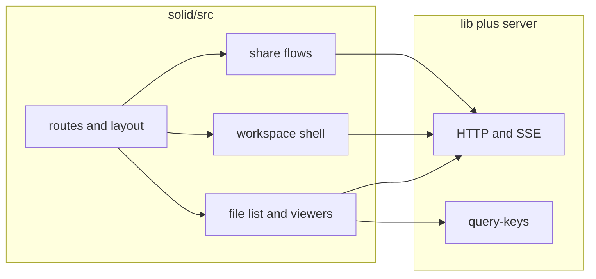

# Solid migration plan (test-driven)

Continue the React → Solid port by **copying Playwright specs** from [`tests/e2e/`](../tests/e2e) into [`tests/e2e-solid/`](../tests/e2e-solid), then implementing the minimum Solid UI until each suite passes. Expand [`tests/run-batches-solid.ts`](../tests/run-batches-solid.ts) as coverage grows.

## E2E parity tooling

- **Spec diff:** `bun run e2e:diff-specs` — lists React-only vs Solid-only Playwright basenames (exit 1 if a React spec has no Solid twin).
- **Gap checklist:** [e2e-gap-matrix.md](e2e-gap-matrix.md) — affordance coverage matrix; update as you add tests.

## Strategy

1. **Copy** `tests/e2e/<name>.spec.ts` → `tests/e2e-solid/<_name>.spec.ts`.
2. **Run** `bun run test:solid -- tests/e2e-solid/<name>.spec.ts` and fix failures by implementing Solid (routes, components, `@tanstack/solid-query`).
3. **Stabilize** selectors: when tests depend on fragile React-only markup, add **`data-testid`** in Solid (and optionally in React later) rather than forking assertion logic in every spec.
4. **Batch** stable specs into [`run-batches-solid.ts`](../tests/run-batches-solid.ts) (`BATCH_ID`, ports `9200 + id`, same fixture pattern as [`tests/run-batches.ts`](../tests/run-batches.ts)).

**Shared code:** Reuse [`lib/`](../lib), [`lib/api.ts`](../lib/api.ts), [`lib/query-keys.ts`](../lib/query-keys.ts), and server routes. Do **not** import React components into Solid—rebuild UI under [`solid/src/`](../solid/src). New Solid queries should use the **same `queryKey` shapes** as React so [`server/html.ts`](../server/html.ts) dehydration stays meaningful.

### UI stack: reimplement, don’t wrap React

The React app uses **[`react-rnd`](https://github.com/bokuweb/react-rnd)** (workspace windows), **[Base UI](https://base-ui.com/react/overview)** (primitives), and **shadcn-style** wrappers in [`components/ui/`](../components/ui). None of that runs in Solid. Plan on **rewriting equivalents in Solid**:

| React / ecosystem         | Solid direction                                                                                                                                                                  |
| ------------------------- | -------------------------------------------------------------------------------------------------------------------------------------------------------------------------------- |
| **react-rnd**             | Custom **draggable + resizable** window chrome (pointer capture, bounds, snap)—fewer wrapper nodes than naive port; align behavior with session geometry in `lib/`.              |
| **@base-ui/react**        | **Kobalte** (common choice) or **hand-rolled** accessible primitives (dialogs, popovers, focus trap)—match behavior and ARIA, not bundle size of duplicating React.              |
| **shadcn / CVA / `cn()`** | Reuse **Tailwind tokens** from `solid/globals.css`; small Solid **variants helpers** where needed; **flatter DOM** (no prop-drilling through 5 wrapper `div`s for every button). |

**Performance and DOM:** Solid’s fine-grained updates are an opportunity for **less intermediate markup** and **fewer rerender-driven wrappers** than React. Prefer **smaller trees** and **stable `data-testid` / role** contracts over pixel-perfect clone of React class names.

### Tests: adapt when it helps

Copied e2e specs are a **baseline**, not scripture. **`tests/e2e-solid/`** may **diverge** from React tests when:

- Assertions are tied to **incidental DOM** (extra wrappers, Lucide-only selectors) and can be replaced by **`role`**, **`data-testid`**, or shorter paths.
- A leaner Solid UI exposes the same **user-visible behavior** with different structure—**update the Solid spec** and document the contract (comment or shared helper).

Keep **behavioral** guarantees (URLs, API calls, accessibility expectations, fixture assumptions). Drop **implementation-detail** locators that fought the old tree.

**Local workflow:** After changes run `bun run tsgo`, `bun run lint-errors`, and the relevant Solid e2e command (see [`AGENTS.md`](../AGENTS.md)).

## Phase order (dependencies first)

| Phase                             | Specs to copy                                                                                                                                                                                                                                                                                                                                                                                                                                                                                                                                                                     | Solid work (summary)                                                                                                                                                                                                                                                         |
| --------------------------------- | --------------------------------------------------------------------------------------------------------------------------------------------------------------------------------------------------------------------------------------------------------------------------------------------------------------------------------------------------------------------------------------------------------------------------------------------------------------------------------------------------------------------------------------------------------------------------------- | ---------------------------------------------------------------------------------------------------------------------------------------------------------------------------------------------------------------------------------------------------------------------------- |
| **A – File browser**              | [`navigation.spec.ts`](../tests/e2e/navigation.spec.ts) — can land **incrementally** (e.g. start with root table only)                                                                                                                                                                                                                                                                                                                                                                                                                                                            | `/` + `dir` query sync, file **table/grid**, breadcrumbs, `..` row, list/grid toggle. `useQuery` for listings + view mode from settings.                                                                                                                                     |
| **B – Upload**                    | [`upload.spec.ts`](../tests/e2e/upload.spec.ts)                                                                                                                                                                                                                                                                                                                                                                                                                                                                                                                                   | Upload mutation, list refresh, same API as React.                                                                                                                                                                                                                            |
| **C – URL + viewers**             | [`url-state.spec.ts`](../tests/e2e/url-state.spec.ts) — **split by `describe`** into multiple files if one file is too large                                                                                                                                                                                                                                                                                                                                                                                                                                                      | `viewing` / `playing` params, dialog viewer chrome, audio/video close behavior preserving other params.                                                                                                                                                                      |
| **D – Simple viewers / download** | [`download.spec.ts`](../tests/e2e/download.spec.ts), [`image-viewer.spec.ts`](../tests/e2e/image-viewer.spec.ts), [`text-editor.spec.ts`](../tests/e2e/text-editor.spec.ts)                                                                                                                                                                                                                                                                                                                                                                                                       | Viewer variants + download flows.                                                                                                                                                                                                                                            |
| **E – Rich media**                | [`audio-player.spec.ts`](../tests/e2e/audio-player.spec.ts), [`video-player.spec.ts`](../tests/e2e/video-player.spec.ts), [`pdf-viewer.spec.ts`](../tests/e2e/pdf-viewer.spec.ts)                                                                                                                                                                                                                                                                                                                                                                                                 | Player/viewer behavior; reuse [`lib/`](../lib) media helpers where possible.                                                                                                                                                                                                 |
| **F – Workspace**                 | [`workspace-layout-snap-resize.spec.ts`](../tests/e2e/workspace-layout-snap-resize.spec.ts), [`workspace-layout-chrome.spec.ts`](../tests/e2e/workspace-layout-chrome.spec.ts), [`workspace-controls.spec.ts`](../tests/e2e/workspace-controls.spec.ts), [`workspace-layout-sessions.spec.ts`](../tests/e2e/workspace-layout-sessions.spec.ts), [`workspace-taskbar-pins.spec.ts`](../tests/e2e/workspace-taskbar-pins.spec.ts), [`workspace-cross-dnd.spec.ts`](../tests/e2e/workspace-cross-dnd.spec.ts), [`workspace-viewers.spec.ts`](../tests/e2e/workspace-viewers.spec.ts) | **Highest effort:** multi-window layout, drag/resize, z-order, sessions. **Rewrite `react-rnd` behavior in Solid** (pointer-driven layout + `lib` geometry). **Spike early**; adapt workspace e2e to **`data-testid` / role**-based checks and a smaller DOM where possible. |
| **G – Shares**                    | [`shares-manage.spec.ts`](../tests/e2e/shares-manage.spec.ts), [`shares-use.spec.ts`](../tests/e2e/shares-use.spec.ts), [`share-workspace.spec.ts`](../tests/e2e/share-workspace.spec.ts), [`share-viewers.spec.ts`](../tests/e2e/share-viewers.spec.ts), [`share-security.spec.ts`](../tests/e2e/share-security.spec.ts), [`share-audio-api.spec.ts`](../tests/e2e/share-audio-api.spec.ts), [`passcode-shares.spec.ts`](../tests/e2e/passcode-shares.spec.ts)                                                                                                                   | Real share UIs (beyond today’s Solid stub), passcode, scoped routes.                                                                                                                                                                                                         |
| **H – KB / folders**              | [`knowledge-base.spec.ts`](../tests/e2e/knowledge-base.spec.ts), [`editable-folders.spec.ts`](../tests/e2e/editable-folders.spec.ts)                                                                                                                                                                                                                                                                                                                                                                                                                                              | KB navigation, editable folders.                                                                                                                                                                                                                                             |
| **I – Realtime / misc**           | [`sse-live-updates.spec.ts`](../tests/e2e/sse-live-updates.spec.ts), [`drag-drop.spec.ts`](../tests/e2e/drag-drop.spec.ts)                                                                                                                                                                                                                                                                                                                                                                                                                                                        | SSE in Solid, DnD parity.                                                                                                                                                                                                                                                    |

**Already in Solid:** [`login.spec.ts`](../tests/e2e-solid/login.spec.ts) (mirror of React login/share stub expectations).

**Remaining React-only specs** not listed above: fold them in when the features they cover exist in Solid (same copy-and-pass approach).

## Per-spec checklist

1. Copy spec into `tests/e2e-solid/`.
2. Fix **only** imports/paths if needed (most use `@playwright/test` + default `storageState`).
3. `bun run test:solid -- tests/e2e-solid/<name>.spec.ts`.
4. Implement Solid until green; prefer **`data-testid`** / **roles** for stable, DOM-shallow contracts; **edit the Solid spec** if you simplify the tree vs React.
5. Add `<name>` to `BATCHES` in `run-batches-solid.ts`; run `bun run test:batch:solid`.
6. `bun run tsgo` + `bun run lint-errors`.

## Architecture direction

- **Router:** Keep pathname **and** `URLSearchParams` in sync with the browser (React uses [`lib/router.ts`](../lib/router.ts); Solid may reproduce a small subscriber or use `@solidjs/router` later).
- **Layout:** Grow from single-page file browser toward `/workspace` and full **share** routes matching server auth rules ([`AGENTS.md`](../AGENTS.md) admin vs shared).
- **Component layer:** Introduce `solid/src/ui/` (or similar) for **Solid-native** primitives—dialogs, buttons, popovers—**without** mirroring every React shadcn file; share **design tokens** via `solid/globals.css`, not component copies.
- **State:** TanStack Solid Query for server state; Zustand or Solid stores only where React already uses local/global client state and porting logic is easier 1:1.

## Risks

- **Workspace / react-rnd replacement:** Largest slice of work; behavior must match persisted layout expectations in [`lib/`](../lib) even if the DOM is flatter.
- **Base UI / shadcn parity:** Focus on **accessibility + behavior**, not copying every nested `span`; missing primitives slow feature port—prioritize Kobalte or minimal custom components per screen.
- **Brittle locators:** Prefer rewriting **Solid** specs over reintroducing bloated markup solely to satisfy old selectors.
- **CI cost:** Decide when **`test:batch:solid`** runs (every PR vs nightly) as the suite grows.

## Definition of done (incremental)

Each ported file: **target spec passes** under `test:solid`, **typecheck/lint clean**, and **admin/shared routing rules** respected for new features.
